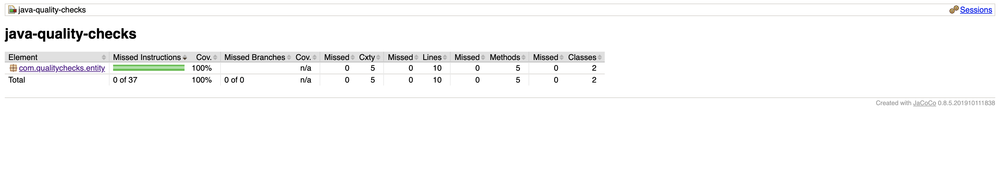
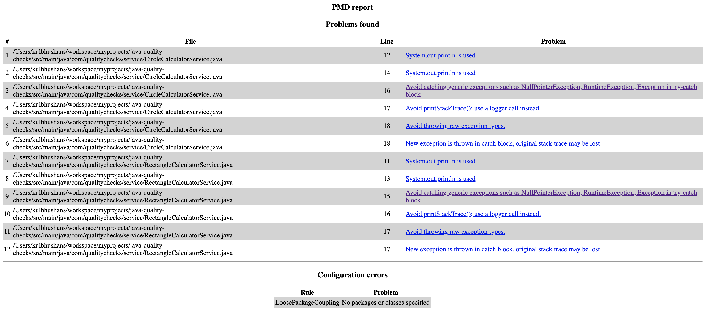
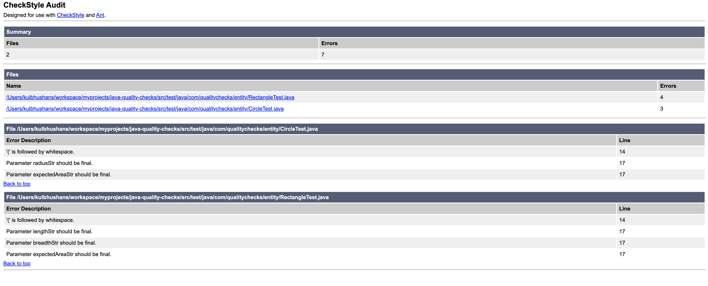

# Java Quality Checks


## Tools
Below are some of the tools that make sure that good practices are followed for the following:
1. Code coverage by unit tests.
2. Common Coding standard in the team.
3. Avoid simple mistakes like unused variables, methods, empty catch blocks, eating exceptions instead of throwing etc.
4. Avoid copy/pasting of code greater than certain number of tokens.

### Jacoco
[JaCoCo](https://www.jacoco.org/jacoco/trunk/index.html) is an open-source toolkit for measuring and reporting Java code coverage.  
Gradle configuration for jacoco is located in [gradle/jacoco.gradle](gradle/jacoco.gradle).

Command:  
`gradle test integrationTest jacocoTestCoverageVerification`

Output:


**Notice that the service package is excluded as it is considered as integration test in this example. This is just for demo purposes and in real life, unit tests should be written for the service package as well**

### PMD
[PMD](https://pmd.github.io/) is a source code analyzer. It finds common programming flaws like unused variables, empty catch blocks, unnecessary object creation, and so forth.  
Gradle configuration for PMD is located in [gradle/pmd.gradle](gradle/pmd.gradle).
The PMD checks are defined in [config/pmd/ruleSet.xml](config/pmd/ruleSet.xml).

Command:  
`gradle pmdMain`

Output:


### CPD
[CPD](https://pmd.sourceforge.io/pmd-4.2.5/cpd.html) is Copy/Paste Detector provided by PMD. It helps in finding duplicate code. 
It is written using [Karp-Rabin](https://xlinux.nist.gov/dads/HTML/karpRabin.html) string matching algorithm.  
Gradle configuration for CPD is located in [gradle/pmd.gradle](gradle/pmd.gradle).  

Command:   
`gradle cpd`

Output: 
```Execution failed for task ':cpdCheck'.
         > A failure occurred while executing de.aaschmid.gradle.plugins.cpd.internal.worker.CpdAction
            > CPD found duplicate code. See the report at file:///java-quality-checks/build/reports/cpd/cpdCheck.text
``` 
Output file: [cpdCheck.text](results/cpdCheck.text)

### Checkstyle
[Checkstyle](https://checkstyle.sourceforge.io/) is a development tool to help programmers write Java code that adheres to a coding standard. It automates the process of checking Java code to spare humans of this boring (but important) task. This makes it ideal for projects that want to enforce a coding standard.    
Gradle configuration for checkstyle is located in [gradle/checkstyle.gradle](gradle/checkstyle.gradle).  
The checkstyle rules for production code are defined in [config/checkstyle/checkstyle.xml](config/checkstyle/checkstyle.xml).  
The checkstyle rules for test code are definned in [config/checkstyle/checkstyleTest.xml](config/checkstyle/checkstyleTest.xml).

Command:  
`gradle checkStyleMain`  
`gradle checkStyleTest`

Output:



  
### SpotBugs
[SpotBugs](https://spotbugs.github.io/) is a program which uses static analysis to look for bugs in Java code. SpotBugs is the spiritual successor of FindBugs, carrying on from the point where it left off with support of its community.  
Gradle configuration for spotbugs is located in [gradle/spotbugs.gradle](gradle/spotbugs.gradle).

Command:  
`gradle spotBugsMain`  


## Practices

### Tests
* Follow the test pyramid when writing tests for the code. This means a lot of unit tests and handful integration tests.
* Make sure assertions are written for each and every unit test and they are asserting the functionality under test.
* Integration tests coverage numbers should not be considered when looking at the coverage numbers.
